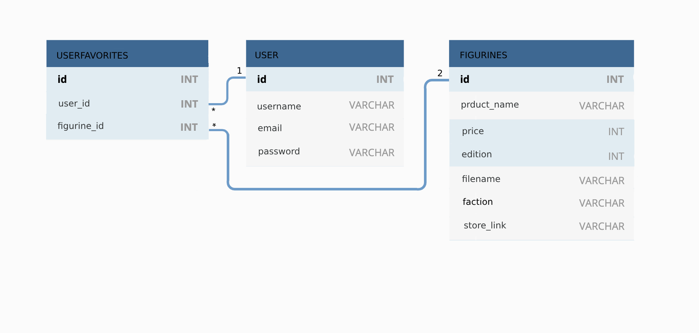

# Solemnace Galleries

## Table of Contents

- [Description](#description)
- [User-Story](#user-story)
- [Features](#features)
- [Contributing](#contributing)
- [Questions](#questions)
- [Links](#links)
- [Images](#images)

## Description

Welcome to Solemnace Galleries, a Warhammer Miniatures Database! This web application allows users to view and manage a database of Warhammer miniatures, helping them create, share, and organize lists of armies. Whether you're a seasoned Warhammer enthusiast or a newcomer, this app provides a user-friendly experience to explore and plan your miniature collections.

## User-Story

User Story.
AS A user on this webpage
I WANT to be able to view a database of warhammer miniatures.
SO THAT I can make lists of armies to view and share.
I WANT to be able to search based on faction.
SO THAT I can favorite models to make an army that is themed appropriatley.
I WANT to be able to traverse to a store page for games workshop
SO THAT I can purchase the models that I have chosen.

## Features

### 1. Browse Miniatures

- View a database of Warhammer miniatures, including images, names, and prices.

### 2. Favorites

- Create and manage a list of models you have favorited and share the link to your friends.

### 3. Store Page Integration

- Easily traverse to a store page for Games Workshop to purchase the models you have chosen.

## Contributing

Contributors : [Maguire Wilson](https://github.com/MacroWil), [Bryn Glofelty](https://github.com/Bryncidently), [Patrick Mulville](https://github.com/pmulville/), [Zachary Short](https://github.com/zachmshort/)

## Links

Link to deployed web application [HERE](https://solemnace-galleries-2d28de62aee4.herokuapp.com/)

## Images

Database chart

Website Homepage Screenshot

